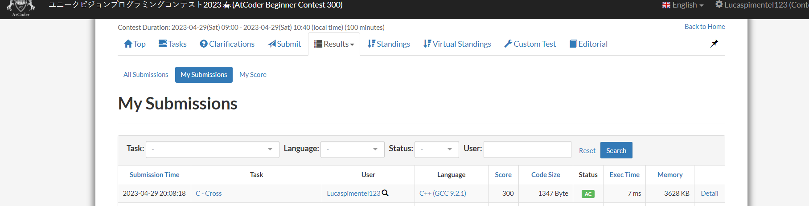
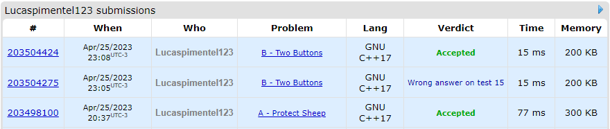
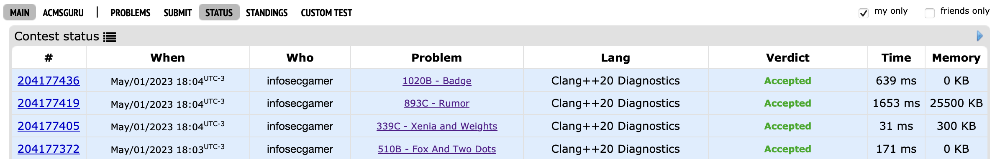

# CP-Problems

**Conteúdo da Disciplina**: Grafos 1 

## Alunos

| Matrícula  | Aluno                        |
| ---------- | ---------------------------- |
| 19/0016663 | Lucas Pimentel Quintão       |
| 20/0017519 | Eurico Menezes de Abreu Neto |

## Sobre

Para este projeto da disciplina optamos por fazer questões de Programação Competitiva de diferentes dificuldades, utilizando os sites CodeForces, Beecrowd, AtCoder e OnlineJudge. As questões escolhidas foram:

- 948A - [Protect Sheep](https://codeforces.com/problemset/problem/948/A)
- 520B - [Two Buttons](https://codeforces.com/problemset/problem/520/B)
- ABC300C - [Cross](https://atcoder.jp/contests/abc300/tasks/abc300_c)
- 1907 - [Colouring Game Scenarios](https://www.beecrowd.com.br/judge/en/problems/view/1907)
- 510B - [Fox And Two Dots](https://codeforces.com/problemset/problem/510/B)
- 339C - [Xenia and Weights](https://codeforces.com/problemset/problem/339/C)
- 893C - [Rumor](https://codeforces.com/contest/893/problem/C)
- 1020B - [Badge](https://codeforces.com/problemset/problem/1020/B)

## Screenshots

### Accepteds

## Instalação

**Linguagem**: C++

Para executar os códigos rode os seguintes comandos:

<code>g++ nomeArquivo.cpp -std=c++11 -o exec</code>

<code>./exec</code>

## Uso

Para testar os exercícios, recomendamos acessar a página do exercício que deseja executar e observar os padrões dos casos de testes disponíveis.

## Vídeo

O vídeo para explicação e demonstração do trabalho pode ser encontrado a partir do seguinte [link](https://youtu.be/Rt0szzcN36w).
